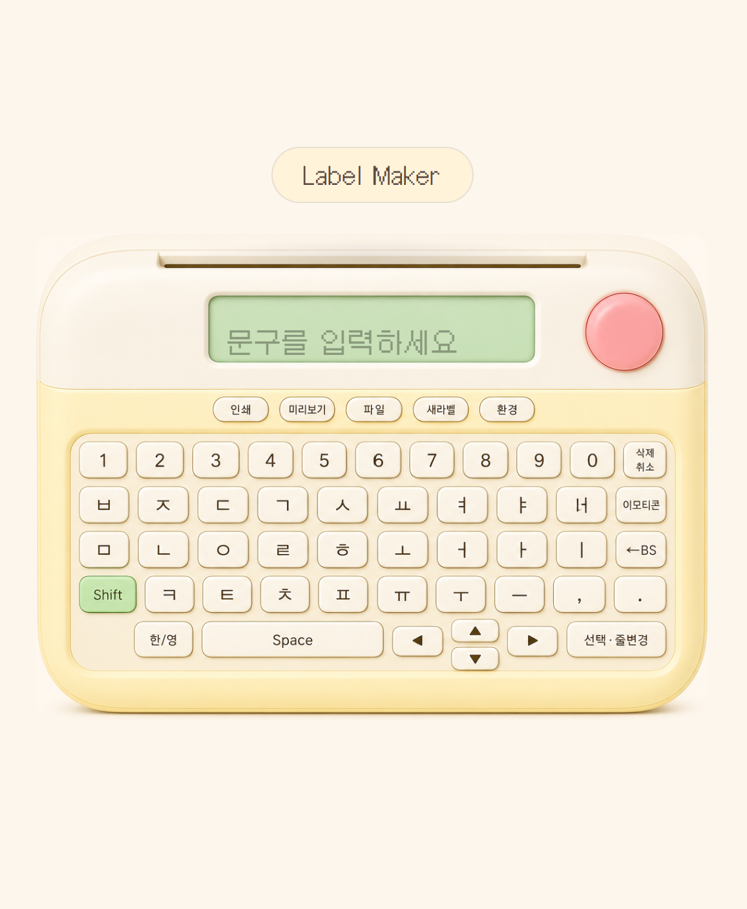
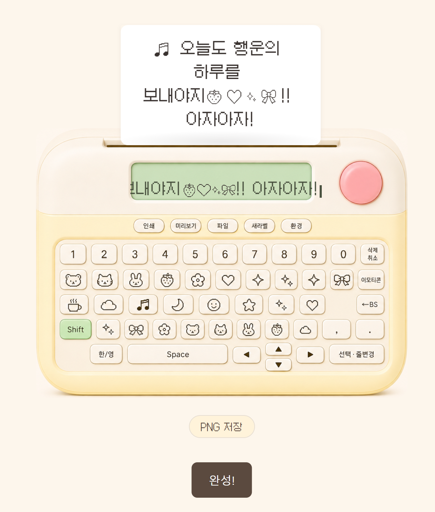

# 라벨메이커 (Label Maker) 🏷️

> 화면 속 귀여운 라벨프린터로 문구·이모지를 찍어 **라벨 스티커를 만들고 PNG로 저장**하는 인터랙티브 웹.
> 실물 감열 라벨기처럼 키를 누르고, LCD에 픽셀 글씨가 뜨고, 영수증처럼 라벨이 두두두 올라옵니다.


- **기간**: 2026.07 (개인 프로젝트)
- **목적**: 인터랙티브 프론트엔드 연습 + 배포 경험
- **스택**: Vanilla HTML/CSS/JS · Canvas · Web Audio API (빌드 도구·서버·외부 API 없음)



*화면 중앙의 라벨프린터 하나로 모든 조작 — 키보드·설정·출력이 기기 안에서 이뤄진다.*

---

## 이렇게 동작해요

```
문구 입력 (온스크린 두벌식 / 실키보드 IME)
→ 환경 버튼으로 테이프색·프레임·사이즈 선택
→ 이모티콘 키로 이모지 자판 전환·삽입
→ 핑크 버튼 → "출력하시겠습니까? 예/아니오"
→ 슬롯에서 라벨이 영수증처럼 올라옴 → PNG 저장
```



*이모지 자판으로 문구와 이모지를 섞어 찍으면, 도트 폰트 라벨이 슬롯에서 영수증처럼 올라온다 (멀티라인 자동 줄바꿈).*

## 주요 기능

| 기능 | 설명 |
|------|------|
| ⌨️ **이미지 키보드** | 실사 감열 라벨기 렌더 위에 투명 히트존을 얹어 진짜 키를 누르는 느낌. 한글·영문·이모지 3개 레이어를 이미지 교체로 전환 |
| 🔤 **두벌식 한글 조합** | 초성·중성·종성 오토마타 직접 구현, 온스크린 클릭과 실키보드 IME 모두 지원 |
| 📟 **픽셀 LCD** | 계산기식 단일 라인 가로 스크롤 — 넘친 글자는 창 밖으로 밀려 숨고 방향키로 되돌아봄. 픽셀 폰트(Galmuri) |
| 🎨 **꾸미기** | 테이프색 6종 · 프레임 6종 · 사이즈(스트립/정사각) · 이모지 스프라이트 |
| 🧾 **영수증 출력** | 감열 프린터처럼 단계적으로 끊기며 올라오는 애니메이션 + 멀티라인 자동 줄바꿈으로 라벨이 길어짐 |
| 🔊 **ASMR 사운드** | Web Audio로 합성한 키 입력음·출력음 (음소거 토글) |
| 💾 **PNG 저장** | Canvas로 렌더한 투명 배경 라벨을 다운로드, 저장 후 초기 화면으로 리셋 |

## 기술 노트

- **정렬**: AI 생성 기기 이미지의 여백을 트림한 뒤 `` + `position:absolute; inset:0` 오버레이 구조로, 좌표 %가 이미지에 정확히 대응하게 설계. 각 히트존 중심이 실제 키캡 위에 있는지 픽셀 스캔으로 자동 검산.
- **라벨 렌더**: 사진 합성 대신 Canvas로 직접 그림 — 테이프색 배경 + 비닐 광택 + 도트 폰트(잉크색 단색) + 이모지 스프라이트.
- **의존성 0**: 프레임워크·번들러 없이 브라우저 표준(Canvas, Web Audio)만 사용.

## 만든 과정 — AI 오케스트레이션

이 프로젝트는 프론트 구현을 Claude Code로 오케스트레이션하고, 컨셉과 디자인 방향, 품질 판정을 직접 맡아 배포까지 완성했다. 화면을 브라우저로 열어 좌표와 픽셀을 수치로 확인하며 다듬었다.

### 키보드 히트존을 픽셀 단위로 정렬

- **문제**: 라벨기 사진 위에 키 클릭 영역을 %로 배치했는데, 좌표를 기기 몸체 기준으로 재고 화면에는 투명 여백까지 포함한 전체 이미지에 적용해 여백 비율만큼 밀렸다.
- **해결**: 이미지 여백을 잘라 `` + `inset:0` 오버레이 구조로 좌표를 이미지에 1:1 대응. 각 히트존 중심 픽셀이 실제 키캡 위에 있는지 코드가 자동 검산.
- **성과**: 한글 48/48, 영문 50/50 히트존이 키캡에 정확히 안착(100%). 한글과 영문 키보드 이미지를 같은 방식으로 정렬.

배포는 GitHub Pages로 붙였다. 정적 파일이라 서버 없이 무료로 올라가고, 커밋할 때마다 자동 갱신된다. AI 오케스트레이션에서 남은 요령 하나는, 요구를 조금씩 더하면 재작업이 커져서 한 번에 완결된 사양으로 넘기는 편이 쌌다는 것.

## 실행 방법

```bash
# 정적 파일이라 아무 정적 서버로 열면 됩니다
npx serve .
# 또는
python -m http.server 5941
```

브라우저에서 `http://localhost:5941` 접속.

## 프로젝트 구조

```
├── index.html
├── css/style.css
├── js/
│   ├── app.js       # 상태·입력·키보드 레이어·설정·출력 플로우
│   ├── hangul.js    # 두벌식 조합 오토마타
│   ├── render.js    # 라벨 Canvas 렌더 (멀티라인·프레임·이모지)
│   └── sound.js     # Web Audio 합성음
├── assets/          # 기기 이미지 · 이모지 스프라이트
└── docs/            # 계획·작업일지
```

---

*개인 학습용 프로젝트입니다. 캐릭터·글리프는 오리지널 디자인으로 제작했습니다.*
